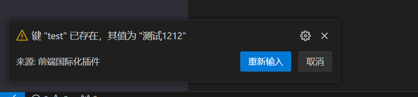
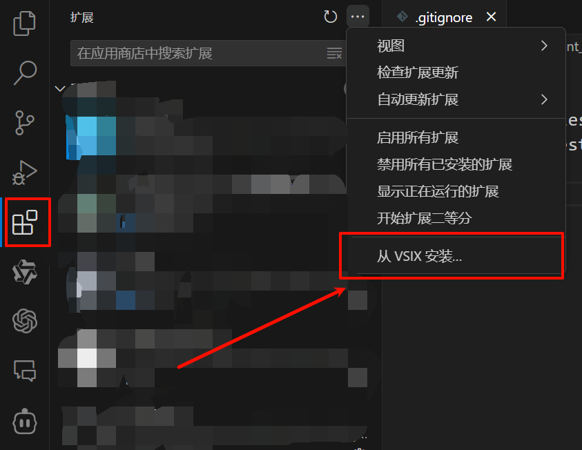
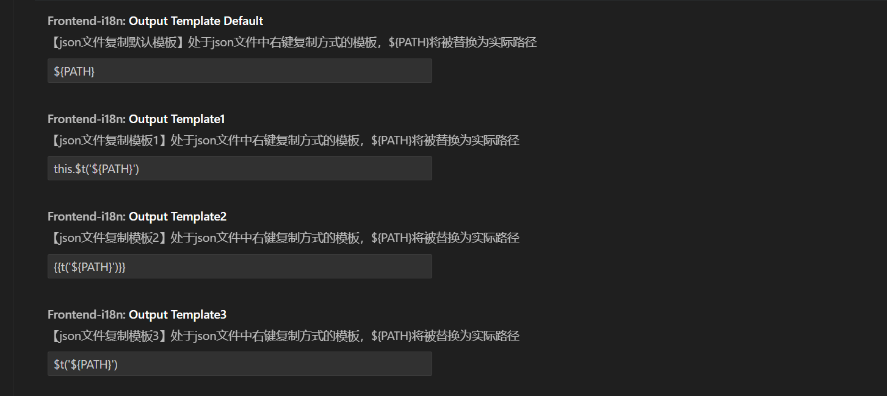
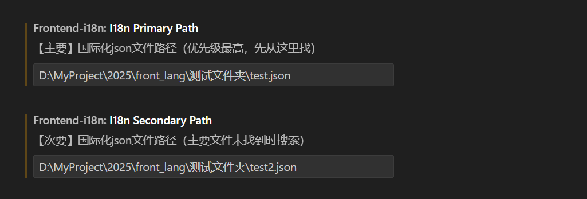
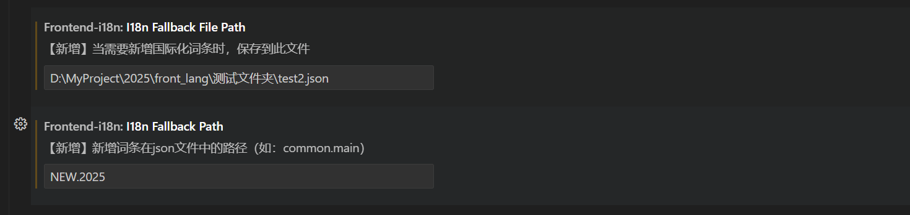
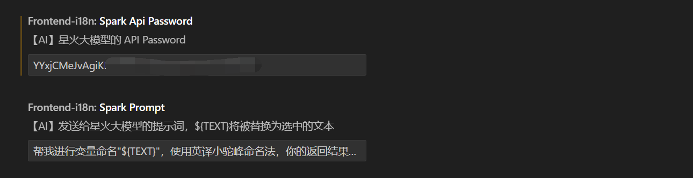
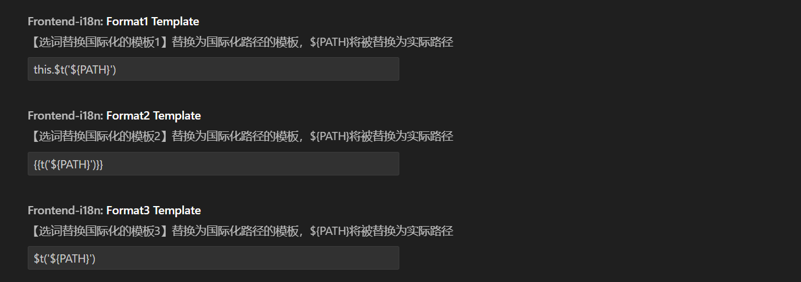

# Frontend i18n Plugin

  

  
  

  
  
  
  

## 📖 Introduction

This is a VSCode-based frontend internationalization (i18n) helper plugin that helps developers quickly and conveniently implement code internationalization, avoiding tedious switching and comparison. This plugin is a secondary development based on [copy-json-path](https://github.com/MaloPolese/copy-json-path) (some features have been added or removed) and provides additional useful functionalities.

## ✨ Features

- 🔍 Quickly find existing i18n entries (select Chinese text, right-click, and choose a replacement format to auto-replace)
- 🚀 One-click replacement of selected text with an i18n path
- 🤖 AI-powered automatic generation of i18n keys and automatic insertion into the configured file and JSON path (based on iFlytek Spark AI)
- 📝 Support for multiple custom i18n formats (`t`, `$t`, `{{t}}`, etc.)
- 💾 Automatically save newly added i18n entries
- 🎯 Customizable i18n file path settings

## 📺 Demo

### ✨ Feature 1 - Quickly copy JSON path within a JSON file

### ✨ Feature 2 - Select text and replace it with a JSON path in multiple formats

### ✨ Feature 3 - AI-powered generation of i18n keys and automatic insertion into specific JSON paths

If the generated key already exists, the plugin will notify you to modify and insert again.

## 🚀 Installation

### Method 1:

1. Search for `frontend-i18n-plugin` in the VSCode extensions marketplace and install it.

### Method 2:

1. Download the latest version of the plugin from the [Releases](https://github.com/weidong-repo/frontend-i18n-plugin/releases/tag/v1.2.0).
2. In VSCode, go to Extensions, click the three dots menu, and choose `Install from VSIX`.  
   
3. Configure the plugin settings as needed.
4. Done! You can start using it.

## 🔧 Configuration

Configure the following settings in VSCode:

- Set the format for copying JSON paths when right-clicking in a JSON file. A default format and three custom formats are available.

  

- Set the path to your i18n files. Customizable paths with different priorities (higher priority paths are searched first).

  

- Configure key-value pairs for new i18n entries, specifying the target file and JSON path.

  

- Set the API key for <a href="https://console.xfyun.cn/services/bm4" target="_blank">iFlytek Spark AI</a> to enable AI-generated i18n keys and custom prompts.

  

- Configure text replacement formats when selecting content for internationalization. Three formats are available and can be customized.

  

## 📝 How to Use

1. **Copy i18n Path**
   - In a JSON file, select the key you want to copy.
   - Right-click and choose a format to copy the JSON path in different styles (customizable formats).

2. **Replace with i18n Path**
   - Select the text to replace.
   - Right-click and choose `Replace with i18n Path`, supporting three formats (configurable in `settings`):
     - Format 1: `t('path.to.key')`
     - Format 2: `{{t('path.to.key')}}`
     - Format 3: `$t('path.to.key')`

3. **Add New i18n Entries**
   - Select the text and right-click to choose a replacement format.
   - If no matching i18n entry is found, an input box will appear.
   - Manually enter the key or click the AI icon to generate one automatically.
   - Confirm the key, and it will be automatically saved and used for replacement.

## 🤝 Contributing

Contributions are welcome! Feel free to submit issues or pull requests.

## 📄 License

[MIT License](LICENSE) © 2024
