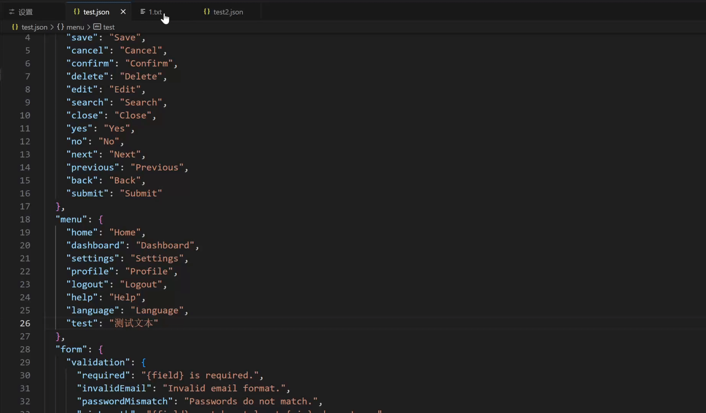

# 前端国际化插件

  

  
  
  
  

## 📖 简介

这是一个基于 VSCode 的前端国际化辅助插件，帮助开发者快速、便捷实现代码的国际化，避免繁琐的切换、比对等。本插件基于 [copy-json-path](https://github.com/MaloPolese/copy-json-path) 上进行二次开发（功能有删减、保留），增加了更多实用的功能。

## ✨ 功能

- 🔍 快速查找已有的国际化词条（选中中文，右键，选择对应的替换形式，一键自动替换）
- 🚀 一键替换选中文本为国际化路径
- 🤖 支持 AI 自动生成国际化 key，并且自动插入设置好的文件及 json 路径（基于星火大模型）
- 📝 支持自定义多种国际化格式（t、$t、{{t}}等）
- 💾 自动保存新增的国际化词条
- 🎯 支持自定义国际化文件路径

## 📺 演示

### ✨ 功能 1 - json 文件内快捷复制层级路径

### ✨ 功能 2 - 选中文本，一键搜索 json 路径替换进多种格式

### ✨ 功能 3 - 智能生成国际化 key，自动插入文件特定的 json 路径中（自定义）

如果自动插入的键值重复，会提醒你修改然后再次插入！

## 🚀 安装

1. 在 `release` 中下载最新版本的安装包
2. vscode 中点击扩展、三个点、点击从`visx`安装
3. 进入插件设置中进行相关的设置
4. 大功告成，开启您的使用！

## 🔧 配置

在 VSCode 设置中配置以下选项：

- 此处设置您在 json 文件中右键复制的格式，总共有一个默认和三个格式，可以自定义

  

- 此处设置您的国际化文件路径，可以自定义（优先级有区分，优先从第一个搜索）

  

- 此处新增国际化的键值对，需要设置新增键值对的文件、以及 json 路径

  

- 此处设置<a href="https://console.xfyun.cn/services/bm4" target="_blank">讯飞星火大模型密钥</a>，可以一键生成国际化 key，以及您自定义的提示词

  

- 此处设置您选中待国际化文本的替换方式，总共有三种，可以自定义

  

## 📝 使用方法

1. **复制国际化路径**

   - 在 JSON 文件中选中要复制的键
   - 右键选择复制方式，可以一键复制多种格式的 json 路径（格式可以自定义）

2. **替换为国际化路径**

   - 选中要替换的文本
   - 右键选择 `替换为国际化路径`，支持三种格式（`setting`中可以自定义）：
     - 方式 1：`t('path.to.key')`
     - 方式 2：`{{t('path.to.key')}}`
     - 方式 3：`$t('path.to.key')`

3. **新增国际化词条**
   - 选中文本后右键选择替换方式
   - 如果未找到匹配的词条，会弹出输入框
   - 可以手动输入 key 或点击 AI 图标自动生成
   - 确认后自动保存并替换选中文本

## 🤝 贡献

欢迎提交 Issue 和 Pull Request！

## 📄 许可

[MIT License](LICENSE) © 2024
